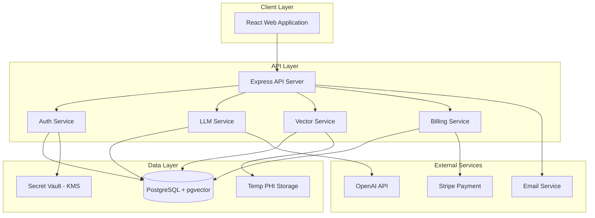

# Design Document

## Overview

Athen-ai is a web-based healthcare AI consulting platform built as a three-tier architecture with a React frontend, Node.js/Express backend API, and PostgreSQL database with pgvector extension for semantic search. The platform enables clinicians to create AI-powered clinical workflows through an LLM-driven planning interface while maintaining HIPAA compliance through a zero-PHI-storage architecture.

### Key Design Principles

1. **Zero PHI Storage**: Original PHI-containing files are deleted immediately after vectorization
2. **Security by Default**: All secrets encrypted at rest, role-based access control, comprehensive audit logging
3. **User-Guided Execution**: Workflows require explicit user confirmation at each step
4. **Cost Transparency**: Credit estimates shown before any resource-consuming operation
5. **Provider Agnostic**: Abstraction layer allows multiple LLM providers with consistent interface

## Architecture

### System Architecture Diagram



### Technology Stack

**Frontend:**
- React 18 with TypeScript
- React Router for navigation
- TanStack Query for server state management
- Tailwind CSS for styling
- Zustand for client state management

**Backend:**
- Node.js 20 LTS
- Express.js for API framework
- TypeScript for type safety
- Prisma ORM for database access

**Database:**
- PostgreSQL 15+ with pgvector extension
- Redis for session storage and caching

**Infrastructure:**
- AWS or GCP for hosting
- AWS KMS or GCP KMS for secret encryption
- S3-compatible storage for temporary file processing
- CloudWatch/Cloud Logging for observability

**External Services:**
- OpenAI API for LLM capabilities
- Stripe for payment processing
- SendGrid or AWS SES for email delivery

## Components and Interfaces

### 1. Authentication and Authorization System

**Components:**
- AuthController: Handles registration, login, logout, email verification
- AuthMiddleware: JWT validation and route protection
- RBACService: Role-based access control enforcement
- SessionManager: Redis-backed session storage

**Key Interfaces:**

```typescript
interface User {
  id: string;
  email: string;
  passwordHash: string;
  name: string;
  role: 'clinician' | 'org_admin' | 'platform_admin';
  specialty?: string; // ABMS specialty code
  emailVerified: boolean;
  onboardingCompleted: boolean;
  orgId?: string;
  createdAt: Date;
  updatedAt: Date;
}


interface AuthToken {
  userId: string;
  role: string;
  sessionId: string;
  exp: number;
}

interface OnboardingData {
  legalName: string;
  role: string;
  specialty: string;
  hipaaAcknowledged: boolean;
  hipaaAcknowledgedAt: Date;
}
```

**Design Decisions:**
- JWT tokens with 24-hour expiration for stateless authentication
- Refresh tokens stored in Redis with 30-day expiration
- Google OAuth via passport-google-oauth20 strategy
- Email verification required before workflow execution (Req 1.4)
- HIPAA acknowledgment captured with timestamp during onboarding (Req 1.3)

### 2. Planner Wizard and Plan Management

**Components:**
- PlannerController: Orchestrates wizard flow and plan generation
- LLMService: Abstraction layer for OpenAI API calls
- PlanRepository: Database operations for plans
- PlanVersioningService: Handles version control and diffs

**Key Interfaces:**

```typescript
interface Plan {
  id: string;
  ownerId: string;
  orgId?: string;
  title: string;
  summary: string;
  steps: PlanStep[];
  privacy: 'private' | 'org' | 'public';
  version: number;
  parentVersionId?: string;
  metadata: PlanMetadata;
  createdAt: Date;
  updatedAt: Date;
}


interface PlanStep {
  id: string;
  order: number;
  title: string;
  description: string;
  toolId?: string;
  actionUrl?: string;
  estimatedCost?: number; // in credits
  estimatedTime?: number; // in minutes
  risks?: string[];
  prerequisites?: string[];
}

interface PlanMetadata {
  goal: string;
  specialty: string;
  phiUsage: boolean;
  budget?: number;
  hipaaCompliant: boolean;
  fdaCompliant: boolean;
  teamSize?: number;
  urgency: 'low' | 'medium' | 'high';
  integrations: string[];
}

interface WizardQuestion {
  id: string;
  text: string;
  type: 'text' | 'select' | 'multiselect' | 'boolean' | 'number';
  options?: string[];
  required: boolean;
  order: number;
}
```

**Design Decisions:**
- 7-10 question wizard flow with progress tracking (Req 2.1)
- OpenAI GPT-4 for plan generation with structured output format
- Immutable version history with parent-child relationships (Req 13.3)
- Diff generation using Myers algorithm for version comparison
- HIPAA/FDA questions always asked regardless of PHI flag (Req 2.5)


### 3. Workflow Execution Engine

**Components:**
- WorkflowController: Manages workflow lifecycle
- WorkflowExecutor: Executes workflow steps with user confirmation
- DryRunService: Simulates workflow with fake data
- WorkflowLogger: Detailed execution trace logging

**Key Interfaces:**

```typescript
interface Workflow {
  id: string;
  planId: string;
  ownerId: string;
  status: 'planned' | 'active' | 'paused';
  config: WorkflowConfig;
  lastRunAt?: Date;
  nextScheduledRun?: Date;
  executionCount: number;
  createdAt: Date;
  updatedAt: Date;
}

interface WorkflowConfig {
  modelSelection: string; // e.g., 'gpt-4', 'gpt-3.5-turbo'
  formDesign?: string;
  formFields?: string[];
  emrLink?: string;
  additionalAgents?: string[];
  parameters: Record<string, any>;
}

interface WorkflowExecution {
  id: string;
  workflowId: string;
  status: 'running' | 'completed' | 'failed' | 'cancelled';
  startedAt: Date;
  completedAt?: Date;
  steps: ExecutionStep[];
  totalCreditsUsed: number;
  error?: string;
}


interface ExecutionStep {
  stepId: string;
  status: 'pending' | 'awaiting_confirmation' | 'executing' | 'completed' | 'failed';
  startedAt?: Date;
  completedAt?: Date;
  output?: any;
  creditsUsed: number;
  userConfirmedAt?: Date;
  error?: string;
}

interface DryRunResult {
  estimatedCredits: number;
  estimatedDuration: number;
  simulatedOutputs: Record<string, any>;
  warnings: string[];
}
```

**Design Decisions:**
- User confirmation required before each step execution (Req 3.4)
- Dry-run generates fake data using predefined templates (Req 3.2)
- Credit estimation based on model pricing and expected token usage
- Workflow state machine: planned → active → paused (with resume capability) (Req 14)
- Execution traces stored with full step details for debugging (Req 3.5)

### 4. Provider Connection Management

**Components:**
- ConnectionController: Manages provider connections
- OAuthService: Handles OAuth flows for supported providers
- SecretVaultService: Encrypts and stores API keys
- ConnectionTestService: Validates connections and retrieves limits

**Key Interfaces:**

```typescript
interface Connection {
  id: string;
  ownerId: string;
  orgId?: string;
  provider: 'openai' | 'google' | 'anthropic';
  authType: 'oauth' | 'api_key';
  scope: string[];
  status: 'valid' | 'expired' | 'revoked';
  lastValidatedAt?: Date;
  expiresAt?: Date;
  metadata: ConnectionMetadata;
  createdAt: Date;
}


interface ConnectionMetadata {
  tier?: string;
  rateLimit?: number;
  quota?: number;
  estimatedMonthlyCost?: number;
}

interface SecretReference {
  connectionId: string;
  kmsKeyId: string;
  encryptedSecret: string;
  secretVersion: number;
}
```

**Design Decisions:**
- Envelope encryption: data keys encrypted with KMS master key (Req 15.3)
- OAuth preferred over API keys where available (Req 4.1)
- Connection test validates auth + minimal API call + retrieves limits (Req 4.3)
- Multiple connections per provider supported with ownership scope (Req 4.5)
- Secrets stored separately from connection metadata for security
- Token expiration reminders via email notification service (Req 18.3)

### 5. File Processing and Vectorization Pipeline

**Components:**
- FileUploadController: Handles file uploads with PHI flagging
- RedactionService: Automated PHI removal using regex + NER models
- VectorizationService: Chunking and embedding generation
- VectorStoreRepository: pgvector operations

**Key Interfaces:**

```typescript
interface FileUpload {
  id: string;
  ownerId: string;
  filename: string;
  contentType: string;
  sizeBytes: number;
  isPHI: boolean;
  redactionStatus: 'pending' | 'preview' | 'approved' | 'rejected';
  tempStorageUrl?: string;
  uploadedAt: Date;
}


interface RedactionPreview {
  fileId: string;
  originalText: string;
  redactedText: string;
  redactions: Redaction[];
  confidence: number;
}

interface Redaction {
  type: 'NAME' | 'DATE' | 'ID' | 'LOCATION' | 'PHONE' | 'EMAIL' | 'SSN' | 'MRN';
  originalValue: string;
  startIndex: number;
  endIndex: number;
  confidence: number;
}

interface VectorChunk {
  id: string;
  ownerId: string;
  fileId: string;
  chunkIndex: number;
  text: string;
  embedding: number[]; // 1536 dimensions for OpenAI ada-002
  metadata: ChunkMetadata;
  createdAt: Date;
}

interface ChunkMetadata {
  filename: string;
  pageNumber?: number;
  section?: string;
  anonymizedIds: Record<string, string>; // original ID type -> random ID
}
```

**Design Decisions:**
- HIPAA 18 identifiers targeted for redaction (Req 5.2)
- Two-stage redaction: regex patterns + spaCy NER model for names
- Preview shows side-by-side comparison before approval (Req 5.2)
- 512 token chunks with 50 token overlap for context preservation
- OpenAI text-embedding-ada-002 for embeddings (1536 dimensions)
- Patient identifiers replaced with cryptographically random UUIDs (Req 6.3)
- Original files deleted immediately after vectorization approval (Req 16.5)
- Temporary storage in encrypted S3 bucket with 24-hour lifecycle policy


### 6. Vector Search and Knowledge Base

**Components:**
- VectorSearchService: Semantic search using pgvector
- EmbeddingService: Generate query embeddings
- SearchRankingService: Re-rank results by relevance

**Key Interfaces:**

```typescript
interface SearchQuery {
  text: string;
  ownerId: string;
  scope: 'user' | 'org' | 'public';
  filters?: SearchFilters;
  limit: number;
}

interface SearchFilters {
  fileIds?: string[];
  dateRange?: { start: Date; end: Date };
  metadata?: Record<string, string>;
}

interface SearchResult {
  chunkId: string;
  fileId: string;
  filename: string;
  text: string;
  similarity: number;
  metadata: ChunkMetadata;
}
```

**Design Decisions:**
- pgvector cosine similarity for vector search
- Default scope limited to user's own vectors (Req 6.1)
- Org-level search opt-in via user preference
- Hybrid search: vector similarity + keyword matching for better recall
- Results limited to top 20 chunks, re-ranked by cross-encoder model

### 7. Credit and Billing System

**Components:**
- BillingController: Credit management and Stripe integration
- CreditTracker: Tracks credit consumption per operation
- CostEstimator: Estimates credits before operations
- StripeWebhookHandler: Processes payment events

**Key Interfaces:**

```typescript
interface CreditAccount {
  userId: string;
  balance: number; // in credits (1 credit = $0.01)
  lifetimeSpent: number;
  autoRechargeEnabled: boolean;
  autoRechargeThreshold: number;
  autoRechargeAmount: number;
  stripeCustomerId?: string;
}


interface CreditTransaction {
  id: string;
  userId: string;
  amount: number; // negative for deductions, positive for purchases
  type: 'llm_call' | 'file_upload' | 'vectorization' | 'workflow_execution' | 'purchase';
  referenceId?: string; // workflow ID, file ID, etc.
  metadata: Record<string, any>;
  createdAt: Date;
}

interface CostEstimate {
  operation: string;
  estimatedCredits: number;
  breakdown: CostBreakdown[];
  confidence: 'low' | 'medium' | 'high';
}

interface CostBreakdown {
  component: string;
  credits: number;
  description: string;
}
```

**Design Decisions:**
- 1 credit = $0.01 USD fixed rate (Req 7.1)
- Credit deduction happens atomically with operation execution
- Cost estimation based on: token count × model pricing + fixed operation costs
- Auto-recharge via Stripe when balance < threshold (Req 7.3)
- Low balance email warning at 100 credits remaining (Req 18.4)
- Stripe customer portal for payment method management
- No payment info stored in platform database (Req 7)

### 8. Clinical Feature Services

**Components:**
- NoteDraftingService: Generates specialty-specific clinical notes
- PatientInstructionsService: Creates patient-friendly instructions
- PriorAuthService: Builds prior authorization packets
- AttestationService: Captures clinician signatures and approvals

**Key Interfaces:**

```typescript
interface ClinicalNote {
  id: string;
  clinicianId: string;
  patientRecordId?: string;
  specialty: 'plastic_surgery' | 'orthopedic' | 'general_surgery' | 'neurosurgery' | 'ent';
  template: 'soap' | 'hp';
  content: string;
  citations: Citation[];
  status: 'draft' | 'attested' | 'inserted';
  attestedAt?: Date;
  attestationSignature?: string;
  createdAt: Date;
}


interface Citation {
  text: string;
  source: string;
  url?: string;
  accessedAt: Date;
}

interface PatientInstructions {
  id: string;
  clinicianId: string;
  language: 'en' | 'es';
  content: string;
  readingLevel: number; // Flesch-Kincaid grade level
  contraindications: string[];
  reviewedAt?: Date;
  approvedAt?: Date;
  createdAt: Date;
}

interface PriorAuthPacket {
  id: string;
  clinicianId: string;
  patientId?: string;
  insuranceCompany: string;
  procedureCode: string;
  checklist: ChecklistItem[];
  attachments: string[]; // file IDs
  status: 'draft' | 'submitted' | 'approved' | 'denied' | 'appealed';
  submittedAt?: Date;
  responseAt?: Date;
  turnaroundTime?: number; // in hours
  createdAt: Date;
}

interface ChecklistItem {
  id: string;
  label: string;
  required: boolean;
  completed: boolean;
  value?: any;
}
```

**Design Decisions:**
- Specialty templates stored as prompt templates with variable substitution (Req 8.1)
- Citations generated using RAG pattern with vector search (Req 8.3)
- Attestation requires signature canvas + timestamp (Req 8.4)
- Reading level calculated using Flesch-Kincaid formula (Req 9.1)
- Spanish translation via OpenAI with medical terminology preservation (Req 9.2)
- Prior auth templates per insurance company stored in database
- Clipboard integration for EHR copy-paste workflow (MVP scope)


### 9. Assistant and Support System

**Components:**
- AssistantController: Manages chat sessions
- AssistantService: OpenAI chat completions with system prompts
- SessionStore: Redis-backed conversation storage

**Key Interfaces:**

```typescript
interface AssistantSession {
  id: string;
  userId: string;
  messages: AssistantMessage[];
  createdAt: Date;
  expiresAt: Date; // session-only, expires on logout
}

interface AssistantMessage {
  role: 'user' | 'assistant' | 'system';
  content: string;
  timestamp: Date;
}

interface AssistantQuery {
  sessionId: string;
  message: string;
  context?: AssistantContext;
}

interface AssistantContext {
  currentPage?: string;
  selectedKBs?: string[];
  connectedTools?: string[];
}
```

**Design Decisions:**
- Session-only storage in Redis with 24-hour TTL (Req 11.3)
- System prompt focuses on platform features and navigation (Req 11.2)
- No context-awareness in MVP (Req 11.4)
- GPT-3.5-turbo for cost efficiency on support queries
- Conversation cleared on logout (Req 11.5)

### 10. Dashboard and Analytics

**Components:**
- DashboardController: Aggregates metrics
- MetricsService: Calculates statistics from events
- EventTracker: Records user actions

**Key Interfaces:**

```typescript
interface DashboardMetrics {
  userId: string;
  timeframe: 'day' | 'week' | 'month' | 'all';
  plansCreated: number;
  activeWorkflows: number;
  creditBalance: number;
  creditsSpent: number;
  workflowExecutions: number;
}


interface UserEvent {
  id: string;
  userId: string;
  eventType: string;
  eventData: Record<string, any>;
  timestamp: Date;
}
```

**Design Decisions:**
- Metrics derived from database queries, not cached (Req 12.2)
- Personal metrics only in MVP, no org aggregation (Req 12.5)
- Timeframe filter applied via SQL date range queries
- Deep links from metric cards to detail views (Req 12.3)

### 11. Audit Logging System

**Components:**
- AuditLogger: Middleware for automatic logging
- AuditRepository: Append-only audit log storage
- AnomalyDetector: Flags suspicious activity

**Key Interfaces:**

```typescript
interface AuditLog {
  id: string;
  actorId: string;
  actorRole: string;
  action: string;
  targetType: string;
  targetId?: string;
  ipAddress: string;
  userAgent: string;
  metadata: Record<string, any>;
  timestamp: Date;
}

interface AnomalyAlert {
  id: string;
  userId: string;
  alertType: 'unusual_location' | 'high_volume_download' | 'external_share_attempt' | 'unusual_pattern';
  severity: 'low' | 'medium' | 'high';
  details: string;
  createdAt: Date;
}
```

**Design Decisions:**
- Append-only audit table with no updates or deletes (Req 15.2)
- Middleware automatically logs all PHI-related operations (Req 15.1)
- IP geolocation for location-based anomaly detection (Req 15.4)
- Anomaly alerts trigger email notifications (Req 18.5)
- Audit logs retained indefinitely (Req 15.2)


### 12. Tool Catalog

**Components:**
- CatalogController: Tool browsing and filtering
- CatalogRepository: Tool metadata storage

**Key Interfaces:**

```typescript
interface Tool {
  id: string;
  name: string;
  description: string;
  category: string;
  provider: string;
  pricing: string;
  complianceTags: string[]; // ['HIPAA', 'FDA', 'SOC2']
  setupComplexity: 'low' | 'medium' | 'high';
  authType: 'oauth' | 'api_key' | 'custom';
  scopes: string[];
  rateLimit?: string;
  setupGuide: string; // markdown
  logoUrl?: string;
}

interface CatalogFilter {
  categories?: string[];
  complianceTags?: string[];
  pricingTiers?: string[];
  setupComplexity?: string[];
}
```

**Design Decisions:**
- Static tool catalog seeded in database (Req 17.1)
- AND logic for multiple filters (Req 17.5)
- Tool selection pre-fills planner wizard constraints (Req 17.4)
- Setup guides include screenshots and step-by-step instructions

## Data Models

### Database Schema

**Core Tables:**

```sql
-- Users and Authentication
CREATE TABLE users (
  id UUID PRIMARY KEY DEFAULT gen_random_uuid(),
  email VARCHAR(255) UNIQUE NOT NULL,
  password_hash VARCHAR(255) NOT NULL,
  name VARCHAR(255) NOT NULL,
  role VARCHAR(50) NOT NULL,
  specialty VARCHAR(100),
  email_verified BOOLEAN DEFAULT FALSE,
  onboarding_completed BOOLEAN DEFAULT FALSE,
  org_id UUID REFERENCES orgs(id),
  created_at TIMESTAMP DEFAULT NOW(),
  updated_at TIMESTAMP DEFAULT NOW()
);


CREATE TABLE onboarding_data (
  user_id UUID PRIMARY KEY REFERENCES users(id),
  legal_name VARCHAR(255) NOT NULL,
  hipaa_acknowledged BOOLEAN NOT NULL,
  hipaa_acknowledged_at TIMESTAMP NOT NULL,
  created_at TIMESTAMP DEFAULT NOW()
);

-- Plans and Workflows
CREATE TABLE plans (
  id UUID PRIMARY KEY DEFAULT gen_random_uuid(),
  owner_id UUID NOT NULL REFERENCES users(id),
  org_id UUID REFERENCES orgs(id),
  title VARCHAR(255) NOT NULL,
  summary TEXT,
  steps JSONB NOT NULL,
  privacy VARCHAR(20) DEFAULT 'private',
  version INTEGER DEFAULT 1,
  parent_version_id UUID REFERENCES plans(id),
  metadata JSONB,
  created_at TIMESTAMP DEFAULT NOW(),
  updated_at TIMESTAMP DEFAULT NOW()
);

CREATE TABLE workflows (
  id UUID PRIMARY KEY DEFAULT gen_random_uuid(),
  plan_id UUID NOT NULL REFERENCES plans(id),
  owner_id UUID NOT NULL REFERENCES users(id),
  status VARCHAR(20) NOT NULL,
  config JSONB NOT NULL,
  last_run_at TIMESTAMP,
  execution_count INTEGER DEFAULT 0,
  created_at TIMESTAMP DEFAULT NOW(),
  updated_at TIMESTAMP DEFAULT NOW()
);

CREATE TABLE workflow_executions (
  id UUID PRIMARY KEY DEFAULT gen_random_uuid(),
  workflow_id UUID NOT NULL REFERENCES workflows(id),
  status VARCHAR(20) NOT NULL,
  started_at TIMESTAMP NOT NULL,
  completed_at TIMESTAMP,
  steps JSONB NOT NULL,
  total_credits_used DECIMAL(10,2) DEFAULT 0,
  error TEXT,
  created_at TIMESTAMP DEFAULT NOW()
);


-- Connections and Secrets
CREATE TABLE connections (
  id UUID PRIMARY KEY DEFAULT gen_random_uuid(),
  owner_id UUID NOT NULL REFERENCES users(id),
  org_id UUID REFERENCES orgs(id),
  provider VARCHAR(50) NOT NULL,
  auth_type VARCHAR(20) NOT NULL,
  scope TEXT[],
  status VARCHAR(20) NOT NULL,
  last_validated_at TIMESTAMP,
  expires_at TIMESTAMP,
  metadata JSONB,
  created_at TIMESTAMP DEFAULT NOW()
);

CREATE TABLE secret_references (
  connection_id UUID PRIMARY KEY REFERENCES connections(id),
  kms_key_id VARCHAR(255) NOT NULL,
  encrypted_secret TEXT NOT NULL,
  secret_version INTEGER DEFAULT 1,
  created_at TIMESTAMP DEFAULT NOW()
);

-- Files and Vectors
CREATE TABLE file_uploads (
  id UUID PRIMARY KEY DEFAULT gen_random_uuid(),
  owner_id UUID NOT NULL REFERENCES users(id),
  filename VARCHAR(255) NOT NULL,
  content_type VARCHAR(100) NOT NULL,
  size_bytes BIGINT NOT NULL,
  is_phi BOOLEAN NOT NULL,
  redaction_status VARCHAR(20) NOT NULL,
  temp_storage_url TEXT,
  uploaded_at TIMESTAMP DEFAULT NOW()
);

CREATE TABLE vector_chunks (
  id UUID PRIMARY KEY DEFAULT gen_random_uuid(),
  owner_id UUID NOT NULL REFERENCES users(id),
  file_id UUID REFERENCES file_uploads(id),
  chunk_index INTEGER NOT NULL,
  text TEXT NOT NULL,
  embedding vector(1536) NOT NULL,
  metadata JSONB,
  created_at TIMESTAMP DEFAULT NOW()
);

CREATE INDEX ON vector_chunks USING ivfflat (embedding vector_cosine_ops);


-- Billing
CREATE TABLE credit_accounts (
  user_id UUID PRIMARY KEY REFERENCES users(id),
  balance DECIMAL(10,2) DEFAULT 0,
  lifetime_spent DECIMAL(10,2) DEFAULT 0,
  auto_recharge_enabled BOOLEAN DEFAULT TRUE,
  auto_recharge_threshold DECIMAL(10,2) DEFAULT 100,
  auto_recharge_amount DECIMAL(10,2) DEFAULT 1000,
  stripe_customer_id VARCHAR(255),
  created_at TIMESTAMP DEFAULT NOW(),
  updated_at TIMESTAMP DEFAULT NOW()
);

CREATE TABLE credit_transactions (
  id UUID PRIMARY KEY DEFAULT gen_random_uuid(),
  user_id UUID NOT NULL REFERENCES users(id),
  amount DECIMAL(10,2) NOT NULL,
  type VARCHAR(50) NOT NULL,
  reference_id UUID,
  metadata JSONB,
  created_at TIMESTAMP DEFAULT NOW()
);

-- Clinical Features
CREATE TABLE clinical_notes (
  id UUID PRIMARY KEY DEFAULT gen_random_uuid(),
  clinician_id UUID NOT NULL REFERENCES users(id),
  patient_record_id VARCHAR(255),
  specialty VARCHAR(50) NOT NULL,
  template VARCHAR(20) NOT NULL,
  content TEXT NOT NULL,
  citations JSONB,
  status VARCHAR(20) NOT NULL,
  attested_at TIMESTAMP,
  attestation_signature TEXT,
  created_at TIMESTAMP DEFAULT NOW()
);

CREATE TABLE patient_instructions (
  id UUID PRIMARY KEY DEFAULT gen_random_uuid(),
  clinician_id UUID NOT NULL REFERENCES users(id),
  language VARCHAR(5) NOT NULL,
  content TEXT NOT NULL,
  reading_level DECIMAL(3,1),
  contraindications TEXT[],
  reviewed_at TIMESTAMP,
  approved_at TIMESTAMP,
  created_at TIMESTAMP DEFAULT NOW()
);


CREATE TABLE prior_auth_packets (
  id UUID PRIMARY KEY DEFAULT gen_random_uuid(),
  clinician_id UUID NOT NULL REFERENCES users(id),
  patient_id VARCHAR(255),
  insurance_company VARCHAR(255) NOT NULL,
  procedure_code VARCHAR(50) NOT NULL,
  checklist JSONB NOT NULL,
  attachments UUID[],
  status VARCHAR(20) NOT NULL,
  submitted_at TIMESTAMP,
  response_at TIMESTAMP,
  turnaround_time INTEGER,
  created_at TIMESTAMP DEFAULT NOW()
);

-- Audit and Security
CREATE TABLE audit_logs (
  id UUID PRIMARY KEY DEFAULT gen_random_uuid(),
  actor_id UUID NOT NULL REFERENCES users(id),
  actor_role VARCHAR(50) NOT NULL,
  action VARCHAR(100) NOT NULL,
  target_type VARCHAR(50),
  target_id UUID,
  ip_address INET NOT NULL,
  user_agent TEXT,
  metadata JSONB,
  timestamp TIMESTAMP DEFAULT NOW()
);

CREATE TABLE anomaly_alerts (
  id UUID PRIMARY KEY DEFAULT gen_random_uuid(),
  user_id UUID NOT NULL REFERENCES users(id),
  alert_type VARCHAR(50) NOT NULL,
  severity VARCHAR(20) NOT NULL,
  details TEXT NOT NULL,
  created_at TIMESTAMP DEFAULT NOW()
);

-- Tool Catalog
CREATE TABLE tools (
  id UUID PRIMARY KEY DEFAULT gen_random_uuid(),
  name VARCHAR(255) NOT NULL,
  description TEXT,
  category VARCHAR(100) NOT NULL,
  provider VARCHAR(255) NOT NULL,
  pricing TEXT,
  compliance_tags TEXT[],
  setup_complexity VARCHAR(20),
  auth_type VARCHAR(20),
  scopes TEXT[],
  rate_limit VARCHAR(100),
  setup_guide TEXT,
  logo_url TEXT,
  created_at TIMESTAMP DEFAULT NOW()
);
```


## Error Handling

### Error Classification

**Client Errors (4xx):**
- 400 Bad Request: Invalid input validation
- 401 Unauthorized: Missing or invalid authentication
- 403 Forbidden: Insufficient permissions
- 404 Not Found: Resource does not exist
- 409 Conflict: Resource state conflict (e.g., duplicate email)
- 422 Unprocessable Entity: Business logic validation failure

**Server Errors (5xx):**
- 500 Internal Server Error: Unexpected server error
- 502 Bad Gateway: External service failure (OpenAI, Stripe)
- 503 Service Unavailable: Temporary service outage
- 504 Gateway Timeout: External service timeout

### Error Response Format

```typescript
interface ErrorResponse {
  error: {
    code: string;
    message: string;
    details?: Record<string, any>;
    requestId: string;
  };
}
```

### Error Handling Strategies

**LLM Service Failures:**
- Retry with exponential backoff (3 attempts)
- Fallback to cached responses for common queries
- User-friendly error messages without exposing API details
- Log full error details for debugging

**File Processing Failures:**
- Validate file type and size before upload
- Graceful degradation if redaction confidence is low
- Allow manual retry with different settings
- Clean up temporary storage on failure

**Payment Failures:**
- Retry failed charges once after 1 hour
- Email notification on payment failure
- Graceful degradation: allow read-only access until payment resolves
- Clear error messages with Stripe customer portal link

**Database Failures:**
- Connection pooling with automatic reconnection
- Transaction rollback on errors
- Read replicas for query load distribution
- Circuit breaker pattern for cascading failure prevention


## Testing Strategy

### Unit Testing

**Coverage Targets:**
- Services: 80% code coverage
- Controllers: 70% code coverage
- Utilities: 90% code coverage

**Key Test Areas:**
- RedactionService: HIPAA identifier detection accuracy
- VectorizationService: Chunking and embedding generation
- CreditTracker: Accurate credit deduction calculations
- AuthMiddleware: JWT validation and RBAC enforcement
- CostEstimator: Credit estimation accuracy

**Testing Tools:**
- Jest for test framework
- Supertest for API endpoint testing
- Mock Service Worker for external API mocking

### Integration Testing

**Critical Flows:**
1. End-to-end user registration and onboarding
2. Plan creation via wizard → workflow activation → execution
3. File upload → redaction → vectorization → search
4. Connection creation → test → usage in workflow
5. Credit deduction → low balance → auto-recharge

**Database Testing:**
- Test database with seed data
- Transaction rollback after each test
- pgvector similarity search accuracy validation

### Security Testing

**HIPAA Compliance:**
- PHI redaction accuracy testing with synthetic data
- Verify no PHI in logs or error messages
- Audit log completeness verification
- Encryption at rest validation

**Authentication & Authorization:**
- JWT token expiration and refresh
- RBAC permission enforcement
- Session hijacking prevention
- CSRF protection validation

### Performance Testing

**Load Testing Scenarios:**
- 100 concurrent users creating plans
- 50 concurrent file uploads and vectorizations
- 1000 vector searches per minute
- Workflow execution under load

**Performance Targets:**
- API response time: p95 < 500ms
- Plan generation: < 10 seconds
- File vectorization: < 30 seconds for 10MB file
- Vector search: < 200ms for top 20 results


### End-to-End Testing

**User Journey Tests:**
1. New clinician onboarding → first plan creation → workflow execution
2. File upload with PHI → redaction approval → use in note drafting
3. Connection setup → workflow configuration → dry-run → execution
4. Credit purchase → workflow execution → credit deduction → low balance warning

**Browser Testing:**
- Chrome, Firefox, Safari, Edge (latest versions)
- Mobile responsive testing (iOS Safari, Chrome Android)

**Testing Tools:**
- Playwright for E2E automation
- Percy for visual regression testing

## Deployment Architecture

### Infrastructure Components

**Application Tier:**
- AWS ECS Fargate or GCP Cloud Run for containerized API
- Auto-scaling based on CPU and memory utilization
- Load balancer with SSL termination
- Health check endpoints for container orchestration

**Database Tier:**
- AWS RDS PostgreSQL or GCP Cloud SQL with pgvector
- Multi-AZ deployment for high availability
- Automated backups with 30-day retention
- Read replicas for query load distribution

**Storage Tier:**
- S3 or GCS for temporary file storage
- Lifecycle policy: delete after 24 hours
- Server-side encryption with KMS
- Versioning disabled (files are temporary)

**Caching Tier:**
- Redis cluster for session storage
- ElastiCache or Memorystore managed service
- 24-hour TTL for assistant sessions
- Connection pooling for API servers

**Secrets Management:**
- AWS Secrets Manager or GCP Secret Manager
- Automatic rotation for database credentials
- Envelope encryption for connection secrets
- IAM-based access control

### CI/CD Pipeline

**Build Pipeline:**
1. Code commit triggers GitHub Actions
2. Run linting and type checking
3. Run unit and integration tests
4. Build Docker image
5. Push to container registry
6. Deploy to staging environment
7. Run E2E tests on staging
8. Manual approval for production
9. Deploy to production with blue-green strategy


### Monitoring and Observability

**Application Monitoring:**
- CloudWatch or Cloud Monitoring for metrics
- Custom metrics: plan creation rate, workflow execution time, credit consumption
- Alarms for error rate > 1%, p95 latency > 1s, credit balance anomalies

**Logging:**
- Structured JSON logs with correlation IDs
- Log levels: ERROR, WARN, INFO, DEBUG
- Centralized logging with CloudWatch Logs or Cloud Logging
- Log retention: 90 days for application logs, indefinite for audit logs

**Tracing:**
- AWS X-Ray or Cloud Trace for distributed tracing
- Trace LLM API calls, database queries, external service calls
- Performance bottleneck identification

**Alerting:**
- PagerDuty or Opsgenie for on-call rotation
- Critical alerts: database down, payment processing failure, PHI exposure risk
- Warning alerts: high error rate, slow response times, low credit balance

## Security Considerations

### HIPAA Compliance Measures

**Technical Safeguards:**
- TLS 1.3 for all data in transit
- AES-256 encryption for data at rest
- Encrypted database backups
- No PHI in logs, error messages, or URLs
- Automatic session timeout after 30 minutes of inactivity

**Administrative Safeguards:**
- BAAs with OpenAI, hosting provider, email service
- Security awareness training for development team
- Incident response plan with breach notification procedures
- Regular security audits and penetration testing

**Physical Safeguards:**
- Cloud provider's SOC 2 Type II compliance
- Data center physical security controls
- Geographic data residency (US-only for MVP)

### Authentication Security

**Password Requirements:**
- Minimum 12 characters
- Must include uppercase, lowercase, number, special character
- bcrypt hashing with cost factor 12
- Password reset via time-limited email token (1 hour expiration)

**Session Management:**
- JWT access tokens with 24-hour expiration
- Refresh tokens with 30-day expiration
- Token revocation on logout
- Redis-backed session blacklist for immediate revocation


### API Security

**Rate Limiting:**
- 100 requests per minute per user for general endpoints
- 10 requests per minute for LLM-heavy endpoints (plan generation, note drafting)
- 5 requests per minute for file uploads
- 429 Too Many Requests response with Retry-After header

**Input Validation:**
- Request body size limit: 10MB
- File upload size limit: 50MB
- SQL injection prevention via parameterized queries
- XSS prevention via input sanitization and CSP headers
- CORS policy: whitelist frontend domain only

**CSRF Protection:**
- Double-submit cookie pattern for state-changing operations
- SameSite=Strict cookie attribute
- CSRF token validation on all POST/PUT/DELETE requests

### Data Privacy

**User Data Isolation:**
- Row-level security policies in PostgreSQL
- User ID filtering in all queries
- Org-level data sharing requires explicit permission
- No cross-user data leakage in vector search

**Data Deletion:**
- Soft delete for plans and workflows (retain for 30 days)
- Hard delete for vector chunks (immediate)
- Cascade deletion for related records
- Audit log entry for all deletions

**Anonymization:**
- Patient identifiers replaced with UUIDs in vector store
- No reversible mapping stored
- Consistent anonymization within user scope
- Different random IDs across users for same patient

## API Design

### RESTful Endpoints

**Authentication:**
```
POST   /api/v1/auth/register
POST   /api/v1/auth/login
POST   /api/v1/auth/logout
POST   /api/v1/auth/refresh
POST   /api/v1/auth/verify-email
POST   /api/v1/auth/forgot-password
POST   /api/v1/auth/reset-password
GET    /api/v1/auth/google
GET    /api/v1/auth/google/callback
```


**Users:**
```
GET    /api/v1/users/me
PATCH  /api/v1/users/me
POST   /api/v1/users/onboarding
```

**Plans:**
```
GET    /api/v1/plans
POST   /api/v1/plans
GET    /api/v1/plans/:id
PATCH  /api/v1/plans/:id
DELETE /api/v1/plans/:id
POST   /api/v1/plans/:id/versions
GET    /api/v1/plans/:id/versions
GET    /api/v1/plans/:id/diff/:versionId
```

**Planner Wizard:**
```
GET    /api/v1/planner/questions
POST   /api/v1/planner/generate
POST   /api/v1/planner/regenerate-step
```

**Workflows:**
```
GET    /api/v1/workflows
POST   /api/v1/workflows
GET    /api/v1/workflows/:id
PATCH  /api/v1/workflows/:id
DELETE /api/v1/workflows/:id
POST   /api/v1/workflows/:id/dry-run
POST   /api/v1/workflows/:id/execute
POST   /api/v1/workflows/:id/pause
POST   /api/v1/workflows/:id/resume
GET    /api/v1/workflows/:id/executions
GET    /api/v1/workflows/:id/executions/:executionId
```

**Connections:**
```
GET    /api/v1/connections
POST   /api/v1/connections
GET    /api/v1/connections/:id
DELETE /api/v1/connections/:id
POST   /api/v1/connections/:id/test
POST   /api/v1/connections/oauth/:provider
GET    /api/v1/connections/oauth/:provider/callback
```

**Files and Vector Store:**
```
POST   /api/v1/files/upload
GET    /api/v1/files
GET    /api/v1/files/:id
DELETE /api/v1/files/:id
POST   /api/v1/files/:id/redaction-preview
POST   /api/v1/files/:id/approve-redaction
POST   /api/v1/files/:id/reject-redaction
POST   /api/v1/vector/search
```


**Clinical Features:**
```
POST   /api/v1/clinical/notes
GET    /api/v1/clinical/notes
GET    /api/v1/clinical/notes/:id
POST   /api/v1/clinical/notes/:id/attest
POST   /api/v1/clinical/patient-instructions
GET    /api/v1/clinical/patient-instructions
GET    /api/v1/clinical/patient-instructions/:id
POST   /api/v1/clinical/patient-instructions/:id/approve
POST   /api/v1/clinical/prior-auth
GET    /api/v1/clinical/prior-auth
GET    /api/v1/clinical/prior-auth/:id
POST   /api/v1/clinical/prior-auth/:id/export
```

**Billing:**
```
GET    /api/v1/billing/account
POST   /api/v1/billing/purchase
GET    /api/v1/billing/transactions
GET    /api/v1/billing/usage
POST   /api/v1/billing/estimate
POST   /api/v1/billing/webhook/stripe
```

**Assistant:**
```
POST   /api/v1/assistant/sessions
POST   /api/v1/assistant/query
GET    /api/v1/assistant/sessions/:id
DELETE /api/v1/assistant/sessions/:id
```

**Dashboard:**
```
GET    /api/v1/dashboard/metrics
GET    /api/v1/dashboard/events
```

**Catalog:**
```
GET    /api/v1/catalog/tools
GET    /api/v1/catalog/tools/:id
```

**Audit (Admin Only):**
```
GET    /api/v1/audit/logs
GET    /api/v1/audit/anomalies
```

### Request/Response Examples

**Plan Generation:**

Request:
```json
POST /api/v1/planner/generate
{
  "answers": {
    "goal": "Automate patient intake forms",
    "specialty": "plastic_surgery",
    "phiUsage": true,
    "budget": 500,
    "hipaaCompliant": true,
    "fdaCompliant": false,
    "teamSize": 1,
    "urgency": "medium",
    "integrations": ["openai"]
  }
}
```


Response:
```json
{
  "plan": {
    "id": "plan_123",
    "title": "Automated Patient Intake for Plastic Surgery",
    "summary": "Streamline patient intake with AI-powered form processing",
    "steps": [
      {
        "id": "step_1",
        "order": 1,
        "title": "Set up OpenAI connection",
        "description": "Connect your OpenAI API key to enable AI processing",
        "toolId": "tool_openai",
        "actionUrl": "/connections/new?provider=openai",
        "estimatedCost": 0,
        "estimatedTime": 5,
        "prerequisites": []
      },
      {
        "id": "step_2",
        "order": 2,
        "title": "Upload patient intake form template",
        "description": "Upload your existing intake form as a reference",
        "estimatedCost": 10,
        "estimatedTime": 10,
        "prerequisites": ["step_1"]
      }
    ],
    "metadata": {
      "goal": "Automate patient intake forms",
      "specialty": "plastic_surgery",
      "phiUsage": true,
      "hipaaCompliant": true,
      "fdaCompliant": false
    },
    "privacy": "private",
    "version": 1
  }
}
```

**Workflow Dry-Run:**

Request:
```json
POST /api/v1/workflows/wf_456/dry-run
{
  "config": {
    "modelSelection": "gpt-4",
    "formFields": ["name", "dob", "procedure", "medical_history"]
  }
}
```

Response:
```json
{
  "dryRun": {
    "estimatedCredits": 150,
    "estimatedDuration": 45,
    "simulatedOutputs": {
      "step_1": "Connection validated successfully",
      "step_2": "Form template processed: 12 fields extracted",
      "step_3": "Sample patient data: John Doe, DOB: 1980-01-01, Procedure: Rhinoplasty"
    },
    "warnings": [
      "PHI detected in form template - redaction will be applied"
    ]
  }
}
```


## Frontend Architecture

### Component Structure

```
src/
├── components/
│   ├── auth/
│   │   ├── LoginForm.tsx
│   │   ├── RegisterForm.tsx
│   │   └── OnboardingWizard.tsx
│   ├── planner/
│   │   ├── WizardFlow.tsx
│   │   ├── QuestionCard.tsx
│   │   └── PlanEditor.tsx
│   ├── workflows/
│   │   ├── WorkflowList.tsx
│   │   ├── WorkflowDetail.tsx
│   │   ├── DryRunModal.tsx
│   │   └── ExecutionLog.tsx
│   ├── connections/
│   │   ├── ConnectionList.tsx
│   │   ├── ConnectionModal.tsx
│   │   └── OAuthCallback.tsx
│   ├── files/
│   │   ├── FileUpload.tsx
│   │   ├── RedactionPreview.tsx
│   │   └── VectorSearch.tsx
│   ├── clinical/
│   │   ├── NoteDrafting.tsx
│   │   ├── PatientInstructions.tsx
│   │   ├── PriorAuthBuilder.tsx
│   │   └── AttestationModal.tsx
│   ├── assistant/
│   │   └── AssistantPanel.tsx
│   ├── dashboard/
│   │   └── Dashboard.tsx
│   └── shared/
│       ├── Layout.tsx
│       ├── Navbar.tsx
│       └── MetricCard.tsx
├── hooks/
│   ├── useAuth.ts
│   ├── usePlans.ts
│   ├── useWorkflows.ts
│   └── useCredits.ts
├── services/
│   ├── api.ts
│   └── websocket.ts
├── stores/
│   ├── authStore.ts
│   └── uiStore.ts
└── utils/
    ├── validation.ts
    └── formatting.ts
```

### State Management Strategy

**Server State (TanStack Query):**
- Plans, workflows, connections, files
- Automatic caching with stale-while-revalidate
- Optimistic updates for mutations
- Background refetching

**Client State (Zustand):**
- Authentication state (user, token)
- UI state (modals, sidebars, notifications)
- Wizard progress
- Assistant session

### Key User Flows

**Onboarding Flow:**
1. Registration form → email verification sent
2. Login → onboarding wizard (4 steps)
3. Legal name → Role selection → Specialty → HIPAA acknowledgment
4. Redirect to dashboard

**Plan Creation Flow:**
1. Click "New Plan" → Wizard starts
2. Answer 7-10 questions with progress bar
3. LLM generates plan (loading state)
4. Review and edit plan steps (drag-to-reorder)
5. Save plan → redirect to plan detail

**Workflow Execution Flow:**
1. Select plan → click "Activate"
2. Configure workflow parameters
3. Click "Dry Run" → review simulated outputs and costs
4. Click "Execute" → step-by-step confirmation UI
5. Confirm each step → view execution progress
6. Completion → view execution log and credit usage


## Performance Optimization

### Frontend Optimization

**Code Splitting:**
- Route-based code splitting with React.lazy
- Separate bundles for clinical features (loaded on demand)
- Vendor bundle separation for stable dependencies

**Asset Optimization:**
- Image lazy loading with Intersection Observer
- WebP format with fallback to PNG/JPG
- SVG icons for UI elements
- Gzip compression for text assets

**Rendering Optimization:**
- React.memo for expensive components
- useMemo/useCallback for expensive computations
- Virtual scrolling for long lists (plans, workflows)
- Debounced search inputs

### Backend Optimization

**Database Optimization:**
- Indexes on frequently queried columns (user_id, plan_id, workflow_id)
- Composite indexes for multi-column queries
- pgvector IVFFlat index for vector similarity search
- Connection pooling with max 20 connections per instance

**Caching Strategy:**
- Redis cache for frequently accessed data (user profiles, tool catalog)
- Cache invalidation on mutations
- TTL: 5 minutes for user data, 1 hour for catalog data
- Cache-aside pattern for read-heavy operations

**API Optimization:**
- Response pagination (default 20 items, max 100)
- Field selection via query params (?fields=id,title)
- ETags for conditional requests
- Compression middleware (gzip/brotli)

### LLM Call Optimization

**Cost Reduction:**
- GPT-3.5-turbo for assistant queries (cheaper)
- GPT-4 only for plan generation and clinical notes
- Token limit enforcement (max 4000 tokens per request)
- Prompt caching for repeated patterns

**Latency Reduction:**
- Streaming responses for long-running LLM calls
- Parallel API calls where possible
- Timeout: 30 seconds for LLM requests
- Fallback to cached responses on timeout

## Migration and Rollout Plan

### Phase 1: Infrastructure Setup (Week 1)
- Provision cloud resources (database, storage, compute)
- Set up CI/CD pipeline
- Configure monitoring and logging
- Establish BAAs with vendors

### Phase 2: Core Backend Development (Weeks 2-3)
- Authentication and user management
- Plan and workflow engines
- Connection management
- File processing pipeline
- Billing system integration

### Phase 3: Frontend Development (Weeks 3-4)
- Authentication and onboarding UI
- Planner wizard interface
- Workflow management UI
- Connection setup flows
- Dashboard and metrics

### Phase 4: Clinical Features (Week 5)
- Note drafting service
- Patient instructions generator
- Prior authorization builder
- Attestation flows

### Phase 5: Testing and Refinement (Week 6)
- Integration testing
- Security audit
- Performance testing
- Bug fixes and polish
- Documentation

### Phase 6: Limited Beta Launch
- Onboard 10-20 clinicians
- Monitor usage and gather feedback
- Iterate on UX pain points
- Validate credit pricing model
- Prepare for broader launch
